```{r packages, message = FALSE, warning = FALSE, echo=FALSE}
whereamI <- "/Users/tbrambor/Dropbox (Pflegedienst Brambor)/Courses/Current/2017 Fall QMSS Modern Data Structures/Lectures/Week 03 Tidyverse/"

# Load packages.
packages <- c("remedy","citr","tidyverse","reprex","addinexamples","shinyjs")

packages <- lapply(packages, FUN = function(x) {
  if(!require(x, character.only = TRUE)) {
    install.packages(x)
  library(x, character.only = TRUE)
  }
}
)

```


```{r Setup, include=FALSE, results='hide', warning=FALSE}

# A Prefix nulling hook.

# Make sure to keep the default for normal processing.
default_output_hook <- knitr::knit_hooks$get("output")

# Output hooks handle normal R console output.
knitr::knit_hooks$set( output = function(x, options) {

  comment <- knitr::opts_current$get("comment")
  if( is.na(comment) ) comment <- ""
  can_null <- grepl( paste0( comment, "\\s*\\[\\d?\\]" ),
                     x, perl = TRUE)
  do_null <- isTRUE( knitr::opts_current$get("null_prefix") )
  if( can_null && do_null ) {
    # By default R print output aligns at the right brace.
    align_index <- regexpr( "\\]", x )[1] - 1
    # Two cases: start or newline
    re <- paste0( "^.{", align_index, "}\\]")
    rep <- comment
    x <- gsub( re, rep,  x )
    re <- paste0( "\\\n.{", align_index, "}\\]")
    rep <- paste0( "\n", comment )
    x <- gsub( re, rep,  x )
  }

  default_output_hook( x, options )

})

knitr::opts_template$set("kill_prefix"=list(comment=NA, null_prefix=TRUE))


## Normal Setup From Here
library(knitr)

knitr::opts_knit$set(root.dir = whereamI)

opts_chunk$set(root.dir = whereamI,
               fig.path="images/",
               cache.path="cache/",
            #   dev=c("png","pdf"),
            #  fig.width=5,
            #  fig.height=4.5,
            #  dpi=300,
            #  fig.show="hold",
            #  fig.lp="fig:",
               cache=FALSE,
            #  par=TRUE,
               echo=TRUE,
               message=FALSE,
               warning=FALSE)
```

## Roadmap

- Some admin stuff
- Tips and Tricks
- Introduction to the Tidyverse
    - Data transformation with `dplyr`
    - Reshaping of data frames with `tidyr`

# Administrative

## Class Repository turning private

```{r, echo=FALSE, out.width = "80%"}
knitr::include_graphics("images/secret.jpeg")
```

## Class Repository turning private

```{r, echo=FALSE, out.width = "80%"}

```

## Homework 1

- Grades will be submitted via coursework's gradebook.
- Comments from TAs will be given via GitHub.
- Late submissions get docked for each day late.

## Online Discussion Forum

- Please minimize emails! Use the discussion forum on coursework.  
- **discussion** tab vs. integrated **piazza** tab. Preferences?  
- Post a minimally reproducible example (see below).

```{r, echo=FALSE, out.width = "100%"}

```

## Github 

- Questions? Comments?
- [Github Tables](https://help.github.com/articles/organizing-information-with-tables/) (also see below)

        | Command | Description |
        | --- | --- |
        | git status | List all new or modified files |
        | git diff | Show file differences that haven't been staged |
        
| Command | Description |
| --- | --- |
| git status | List all new or modified files |
| git diff | Show file differences that haven't been staged |

# Tips and Tricks

## Make RMarkdown (even) easier

[`remedy`](https://github.com/ThinkR-open/remedy) provides addins to facilitate writing in markdown with RStudio.

```{r, echo=FALSE, out.width = "100%"}
knitr::include_graphics("images/remedy_example.gif")
```

## Ugh, making a table

```{r, echo=FALSE, out.width = "100%"}
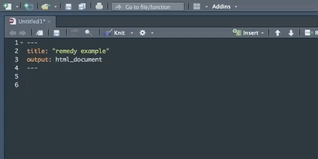
```

## Citations in RMarkdown

Use BibTeX? Search and insert references with just a few keystrokes with the [citr](https://github.com/crsh/citr) add-in. 

```{r, echo=FALSE, out.width = "90%"}
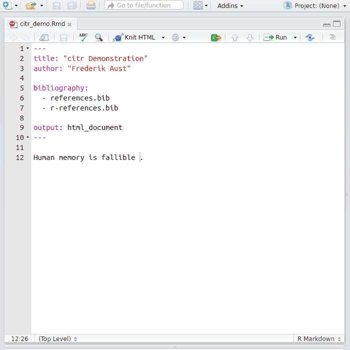
```

## Git in RStudio

RStudio can directly interact with Git (and GitHub) to [version control your projects](http://jnmaloof.github.io/BIS180L_web/2017/04/20/1-Git-in-R/).

```{r, echo=FALSE, out.width = "90%"}
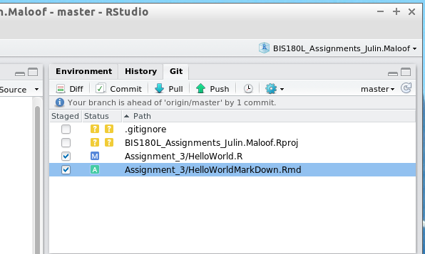
```

# Introduction to the Tidyverse

## Resources for the Tidyverse

- **Website**: tidyverse.org  
- **Package**: Install the complete tidyverse with:
`install.packages("tidyverse")`  
- **Book**: Wickham, H., & Grolemund, G. (2017). [R for Data Science: Import, Tidy, Transform, Visualize, and Model Data](http://r4ds.had.co.nz) (1st ed.). O’Reilly Media.
- **Additional Resources to Learn**:
    - RStudio Webinars on [Data Wrangling](https://www.rstudio.com/resources/webinars/data-wrangling-with-r-and-rstudio/), the [tidyverse](https://www.rstudio.com/resources/videos/data-science-in-the-tidyverse/) etc.
    - [Data Wranglin Cheat Sheet](https://www.rstudio.com/wp-content/uploads/2015/02/data-wrangling-cheatsheet.pdf)

## I am stuck

```{r, echo=FALSE, out.width = "40%"}

```

- [stackoverflow.com](https://stackoverflow.com/questions/tagged/r). Please make sure to [tag your question](https://stackoverflow.com/help/tagging) with R and tidyverse so that the right people are more likely to see it.
- [RStudio Community Forum on Tidyverse](https://community.rstudio.com/c/tidyverse)

## I need help... from the TA

If you ask for help from a TA, it is easiest if they can reproduce the error you see.

Make a **repr**educible **ex**ample 

The [package `reprex`](http://reprex.tidyverse.org) helps to do that.

## ReprEx

```{r, echo=FALSE, out.width = "100%"}
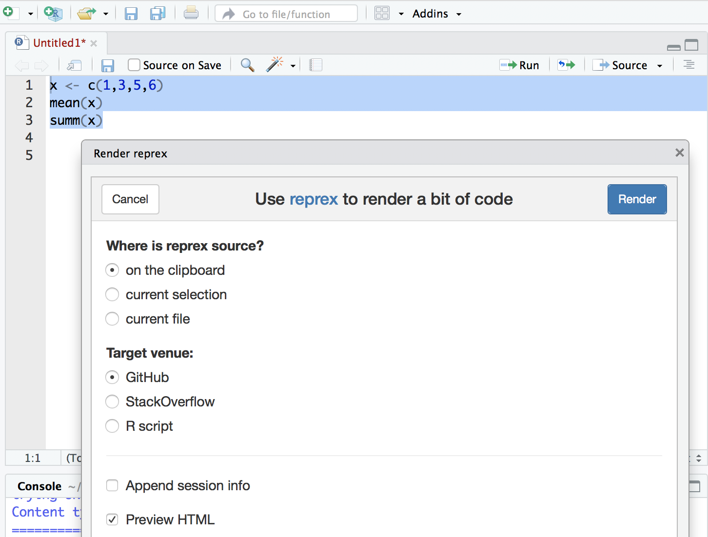
```

## ReprEx {.build}

Here is the code in questions. Error message appears after third line.
```{r echo=TRUE, eval=FALSE}
y <- c(1,2,5,6,8)  
mean(y)  
summ(y)  
```

And here is the reproducible example:

``` r
y <- c(1,2,5,6,8)  
mean(y)  
#> [1] 4.4
summ(y) 
#> Error in summ(y): could not find function "summ"
```

# The `%>%` operator

```{r, echo=FALSE, out.width = "50%"}
knitr::include_graphics("images/magrittr.png")
```

## The `%>%` operator

- Not required but extremely convenient. Makes code more readable.
- http://magrittr.tidyverse.org/

```{}
filter(data, variable == numeric_value)
```

or

```{}
data %>% filter(variable == numeric_value)
```

## The `%>%` operator {.smaller .build}

```
arrange(
    summarize(
            filter(data, variable == "numeric_value"),
            Total = sum(variable)
     ),
    desc(Total)
)
```
```
a <- filter(data, variable == "numeric_value")
b <- summarise(a, Total = sum(variable))
c <- arrange(b, desc(Total))
```
```
data %>%
        filter(variable == "value") %>%
        summarise(Total = sum(variable)) %>%
        arrange(desc(Total))
```

Same results but the %>% operator is more efficient and legible.

# Tidyverse

## Tidyverse {.columns-2}

**Core Packages**

- `ggplot2` (graphics)
- `tibble` (data frames and tables)
- `tidyr` (make tidy)
- `readr` (read in tabular formats)
- `purrr` (functional programming)
- `dplyr` (manipulate data)

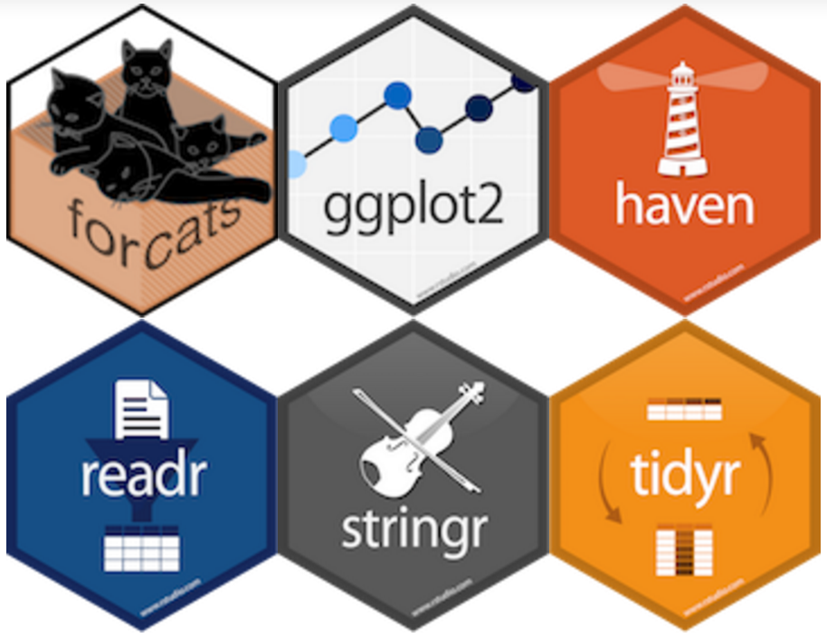

## How do we get it?

To get all the tidyverse packages, you can install it with a single command:

```{r eval=FALSE}
install.packages(tidyverse)
```

## Overall Workflow


Let's try to follow the workflow by reading in some excel data, cleaning it, and preparing for visualization. 


```{r Import tidyverse}
library(tidyverse) # Import tidyverse
```

# Data processing with `dplyr`

 - a package that transforms data

## Read in Data


## Sample Dataset A

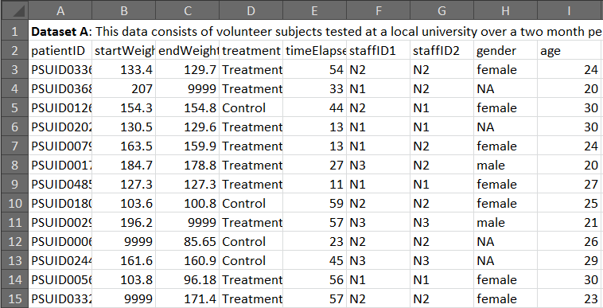

## Sample Dataset B

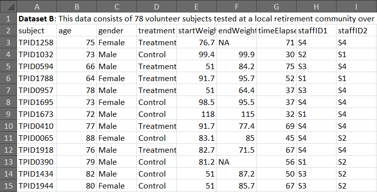

## Let's Read in the Data {.smaller}

```{r Read in data}
# Using the readxl package to read in Excel files
library(readxl)
rawData <- read_excel(path = "data/data_example1.xlsx", # Path to file
                    sheet = 2, # We want the second sheet
                    skip = 1, # Skip the first row
                    na = "NA") # Missing characters are "NA"
```

## Take a Look at the Data {.smaller}

```{r}
head(rawData) # Tibble shows small bit of the data
```

## Another Way to Look at Data {.smaller}

```{r}
rawData
```

## The Tidyverse is all about verbs and pipes

Let's look at a typical tidyverse operation. 

```{r}
cleanData <- rawData %>%
  filter(gender == "Male") %>%
  mutate(diffWeight = startWeight - endWeight,
         weightChangePerDay = diffWeight / timeElapsed)
```

We'll take this apart bit by bit.

## Take a Look at the transformed data {.smaller}

```{r}
# We filtered for "Males" and "mutated" some data
cleanData
```

## Pipes let you go from start to finish

```{r, eval=FALSE}
# Reminder of what we did
cleanData <- rawData %>%
  filter(gender == "Male") %>%
  mutate(diffWeight = startWeight - endWeight,
         weightChangePerDay = diffWeight / timeElapsed)
```

Remember `%>%`, the pipe character?

It lets you take the output of one function and make it the input of another function.

```{r, eval=FALSE}
cleanData <- rawData %>%
  filter(gender == "Male")
```

When you chain multiple functions together, you are building a **pipeline**.

## Some basic verbs for manipulating data

The nice thing about the tidyverse is that most of the functions are defined as verbs that you do to data.

- `filter()` - remove rows according to a criteria
- `select()` - select columns by name
- `mutate()` - calculate new column variables by manipulating data
- `arrange()` - sort data by columns
- `summarize()` - compute summary statistics

## `dplyr::filter()` {.smaller .build}

`filter()` lets you select rows according to a criteria. You can use `|` (OR) and `&` (AND) to chain together logical statements.

```{r out.width = "95%", echo = FALSE}
knitr::include_graphics("images/filter.png")
```

```{r message=FALSE}
filteredData <- rawData %>%
  filter(gender == "Male")

filteredData[1:4, ] # Filtered for just "Male"
```

## `dplyr::filter()` 

How would we also filter the dataset for patients who had `startWeights` greater than 150?

Note that any statement or function that produces a boolean vector (such as `is.na(variablename)`) can be used here.

## `dplyr::select()` {.smaller .build}

`select()` lets you select columns in your dataset. You can also rename them by passing in the new name as an equals statement:

```{r out.width = "95%", echo = FALSE}
knitr::include_graphics("images/select.png")
```

```{r}
selectedData <- filteredData %>% 
  # Rename patientID to patient, select startWeight, endWeight, diffWeight
  select(patient = subject, startWeight, endWeight)

head(selectedData) 
```

## `dplyr::select()`

Rather than specifying all columns you want to select, you can also select variables based on their names.

+ `starts_with()`: starts with a prefix
+ `ends_with()`: ends with a prefix
+ `contains()`: contains a literal string
+ `matches()`: matches a regular expression
+ `num_range()`: a numerical range like x01, x02, x03.
+ `one_of()`: variables in character vector.
+ `everything()`: all variables.

## `dplyr::mutate()` {.smaller .build}

`mutate()` is a powerful command to help transform data and add it as a new column into the `data.frame`.

```{r out.width = "95%", echo = FALSE}
knitr::include_graphics("images/mutate.png")
```

```{r}
# Calculate a new variable based on other variables
mutatedData <- rawData %>%
  mutate(diffWeight = startWeight - endWeight)
mutatedData[1:4, ] %>% select(startWeight, endWeight, diffWeight)
```

## `dplyr::mutate()` {.smaller .build}

Once you've defined a new column with `mutate()`, you can use it just like any other variable:

```{r}
# Add a column with the same value for each entry
mutatedData <- mutatedData %>% mutate(site = "Site1") %>%
  mutate(weightLossPerDay = diffWeight / timeElapsed)

head(mutatedData)
```

## `dplyr::mutate()` {.smaller}

`Mutate` can alse be used to modify existing variables or delete variables:

```{r}
rawData %>%
  mutate(subject = NULL,
  startWeight_in_pounds = startWeight * 2.20462 # convert to pounds
)
```

## Chaining it all together with pipes {.smaller}

```{r}
cleanData <- rawData %>%
  filter(gender == "Male") %>%
  mutate(diffWeight = startWeight - endWeight,
         weightChangePerDay = diffWeight / timeElapsed)
head(cleanData)
```

## `dplyr::summarize()`

Now, we have clean data. How can we calculate summaries such as means and standard deviations by treatment?

```{r out.width = "95%", echo = FALSE}
knitr::include_graphics("images/summarise.png")
```

## Summarizing Data 

```{r}
summarizedData <- cleanData %>% group_by(treatment) %>%
  summarize(meanLoss = mean(weightChangePerDay, na.rm = TRUE),
            sdLoss = sd(weightChangePerDay, na.rm = TRUE))

summarizedData
```

In order to do this we use two functions here: `group_by()` and `summarize()`. You can think of `group_by` as separating the data out into smaller data.frames (separated by the variable), and then with `summarize`, we perform an operation on them.

## `dplyr::summarize()` - Useful functions

There are several useful functions that can be used with `summarize()`:

- Center: `mean()`, `median()`
- Spread: `sd()`, `IQR()`
- Range: `min()`, `max()`, `quantile()`
- Position: `first()`, `last()`, `nth()`
- Count: `n()`, `n_distinct()`
- Logical: `any()`, `all()`

## Sorting the data

```{r out.width = "120%", echo = FALSE}

```

```{r out.width = "120%", echo = FALSE}

```

## Sorting the data {.smaller}

```{r}
cleanData %>% arrange(desc(startWeight))
```

## Start Exploring the Data! -- Just not here :-( {.smaller}

```{r message=FALSE, warning=FALSE, paged.print=FALSE, out.width = "80%"}
cleanData %>% ggplot(aes(x = age, y = diffWeight,
                         color = treatment)) +
    geom_point() + facet_wrap(~ staffID1)
```

# Reshaping Data with `tidyr`

  `tidyr` - a package that reshapes the layout of dataframes

## What is Tidy Data?

[According to Jeff Leek](https://leanpub.com/datastyle), tidy data has the following properties:

1. Each variable should have its own column.
2. Each observation of that variable should be in its own row
3. One table for each "kind" of variable (e.g. data on finance and health)
4. Multiple tables should have an identifier column to let you join them together.


## Why Tidy Data?

In short, most R packages expect tidy data in one form or another. 

Specifically: tidy data makes it easy to:

- Manipulate into different forms (reshaping/summarizing)
- Join with other tidy data
- Visualize
- Load into databases, etc.

Much of your time as an analyst is spent getting data into a form that you can analyse.

## Reshaping Data

Oftentimes, you will need to change the format of the data. This might include:

```{r out.width = "100%", echo = FALSE}
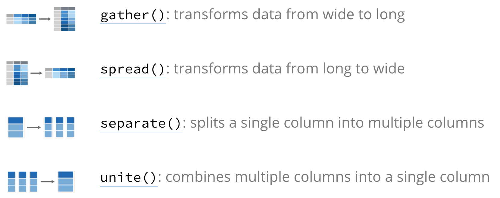
```

## Types of Data

**Problem**: Some of the column names are not names of variables, but values of a variable.

```{r}
table1
```

## Types of Data {.smaller}

**Problem**: Information for observations are spread across several rows.

```{r}
table2
```

## Types of Data

**Problem**: Information for two variables (cases and population) are contained in a single column.

```{r}
table3
```

## Types of Data {.smaller}

**Problem**: Variables are spread across different datasets.

```{r}
# Spread across two tibbles
table4a  # cases
table4b  # population
```

# Tutorial: Reshaping Data in R

## Gather {.smaller}

```{r out.width = "30%", echo = FALSE}

```

      Function:       gather(data, key, value, ..., na.rm = FALSE, convert = FALSE)
      Same as:        data %>% gather(key, value, ..., na.rm = FALSE, convert = FALSE)
      
      Arguments:
              data:           data frame
              key:            column name representing new variable
              value:          column name representing variable values
              ...:            names of columns to gather (or not gather)
              na.rm:          option to remove observations with missing values 
                              (represented by NAs)
              convert:        if TRUE will automatically convert values to logical, 
                              integer, numeric, complex or 
                              factor as appropriate

## Gather {.smaller}

```{r out.width = "30%", echo = FALSE}

```

```{r}
table4a # cases
```

- The set of _columns that represent values, not variables_. In this example, those are the columns 1999 and 2000.
- The _name of the variable whose values form the column names_. It is called the **key**, and here it is year.
- The _name of the variable whose values are spread over the cells_. They are called **value**, and here it’s the number of cases.

## Gather {.smaller}

```{r out.width = "30%", echo = FALSE}

```

```{r}
table4a %>% 
  gather(`1999`, `2000`, key = "year", value = "cases")
```

## Gather {.smaller}

```{r out.width = "30%", echo = FALSE}

```

```{r out.width = "100%", echo = FALSE}
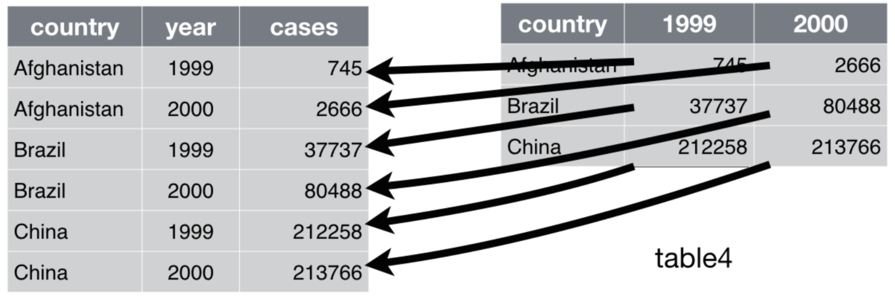
```

## Gather {.smaller}

```{r out.width = "30%", echo = FALSE}

```

These all produce the same results:

```{r, eval=FALSE}
table4a %>% gather(Year, cases, `1999`:`2000`)
table4a %>% gather(Year, cases, `1999`, `2000`)
table4a %>% gather(Year, cases, 2:3)
table4a %>% gather(Year, cases, -country)
```

## Gather {.smaller}

```{r out.width = "30%", echo = FALSE}

```

We can `gather()` table4b the same way. 

```{r}
table4b %>% 
  gather(`1999`, `2000`, key = "year", value = "population")
```

## Gather and Join {.smaller}

To combine the tidied versions of table4a and table4b into a single tibble, we need to use `dplyr::left_join()` (more on joins later).

```{r}
tidy4a <- table4a %>% 
  gather(`1999`, `2000`, key = "year", value = "cases")
tidy4b <- table4b %>% 
  gather(`1999`, `2000`, key = "year", value = "population")
left_join(tidy4a, tidy4b)
```

## Spread {.smaller}

```{r out.width = "30%", echo = FALSE}
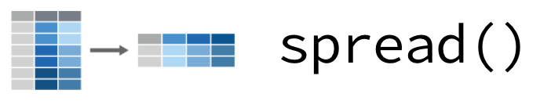
```

      Function:       spread(data, key, value, fill = NA, convert = FALSE)
      Same as:        data %>% spread(key, value, fill = NA, convert = FALSE)
      
      Arguments:
              data:           data frame
              key:            column values to convert to multiple columns
              value:          single column values to convert to multiple columns' values 
              fill:           If there isn't a value for every combination of the 
                              other variables and the key column, this value will be 
                              substituted
              convert:        if TRUE will automatically convert values to logical, 
                              integer, numeric, complex or factor as appropriate
       
## Spread {.smaller}

```{r out.width = "30%", echo = FALSE}

```

```{r}
table2 
```

- an observation is a country in a year, but _each observation is spread across two rows_.

We only need two parameters to use `spread()`:  
- The _column that contains variable names_, the **key** column. Here, it’s type.
- The _column that contains values forms multiple variables_, the value **column**. Here it’s count.

## Spread {.smaller}

```{r out.width = "30%", echo = FALSE}

```

```{r}
spread(table2, key = type, value = count)
```

## Spread {.smaller}

```{r out.width = "30%", echo = FALSE}

```

```{r out.width = "100%", echo = FALSE}
knitr::include_graphics("images/spread_table2.png")
```

## Separate {.smaller}

```{r out.width = "30%", echo = FALSE}
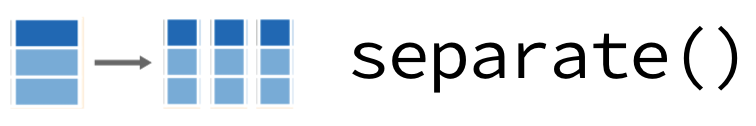
```

Splits a single variable (column) into multiple variables (columns).

    Function:       separate(data, col, into, sep = " ", remove = TRUE, convert = FALSE)
    Same as:        data %>% separate(col, into, sep = " ", remove = TRUE, convert = FALSE)
    
    Arguments:
            data:           data frame
            col:            column name representing current variable
            into:           names of variables representing new variables
            sep:            how to separate current variable (char, num, or symbol)
            remove:         if TRUE, remove input column from output data frame
            convert:        if TRUE will automatically convert values to logical, 
            integer, numeric, complex or factor as appropriate

## Separate {.smaller}

```{r out.width = "30%", echo = FALSE}

```

```{r}
table3
```

- The `rate` column contains both `cases` and `population` variables, and we need to split it into two variables.  
- `separate()` takes the name of the column to separate, and the names of the columns to separate into

## Separate {.smaller}

```{r out.width = "30%", echo = FALSE}

```

```{r}
table3 %>% 
  separate(rate, into = c("cases", "population"))
```

## Separate {.smaller}

```{r out.width = "30%", echo = FALSE}

```

```{r out.width = "100%", echo = FALSE}
knitr::include_graphics("images/separate_table3.png")
```

## Separate {.smaller}

```{r out.width = "30%", echo = FALSE}

```

By default, `separate()` works on any non-alphanumeric character it finds. 

But we can also specify how to separate:

```{r}
table3 %>% 
  separate(rate, into = c("cases", "population"), sep = "/")
```

Note: This is really a regular expression, a topic we will return to later in much more detail.

## Unite {.smaller}

```{r out.width = "30%", echo = FALSE}
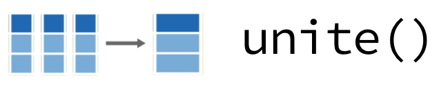
```

Combines multiple variables (columns) into a single variable (column). Not as commonly used, but good to know it exists.

    Function:       unite(data, col, ..., sep = " ", remove = TRUE)
    Same as:        data %>% unite(col, ..., sep = " ", remove = TRUE)
    
    Arguments:
            data:           data frame
            col:            column name of new "merged" column
            ...:            names of columns to merge
            sep:            separator to use between merged values
            remove:         if TRUE, remove input column from output data frame

## Unite {.smaller}

```{r out.width = "30%", echo = FALSE}

```

```{r}
table5
```

## Unite {.smaller}

```{r out.width = "30%", echo = FALSE}

```

```{r}
table5 %>% 
  unite(new, century, year)
```

## Additional Resources {.smaller}

This lecture merely touches on the basics that these two packages - `dplyr` and `tidyr` can do. There are several other resources you can check out to learn more. 

+ R Studio's [Data wrangling with R and RStudio webinar](http://www.rstudio.com/resources/webinars/)
+ R Studio's [Data wrangling GitHub repository](https://github.com/rstudio/webinars/blob/master/2015-01/wrangling-webinar.pdf)
+ R Studio's [Data wrangling cheat sheet](http://www.rstudio.com/resources/cheatsheets/)
+ Hadley Wickham’s dplyr tutorial at useR! 2014, [Part 1](http://www.r-bloggers.com/hadley-wickhams-dplyr-tutorial-at-user-2014-part-1/)
+ Hadley Wickham’s dplyr tutorial at useR! 2014, [Part 2](http://www.r-bloggers.com/hadley-wickhams-dplyr-tutorial-at-user-2014-part-2/)
+ Hadley Wickham's paper on [Tidy Data](http://vita.had.co.nz/papers/tidy-data.html)

## Don't forget the [cheat sheet](https://www.rstudio.com/wp-content/uploads/2015/02/data-wrangling-cheatsheet.pdf)

```{r out.width = "90%", echo = FALSE}
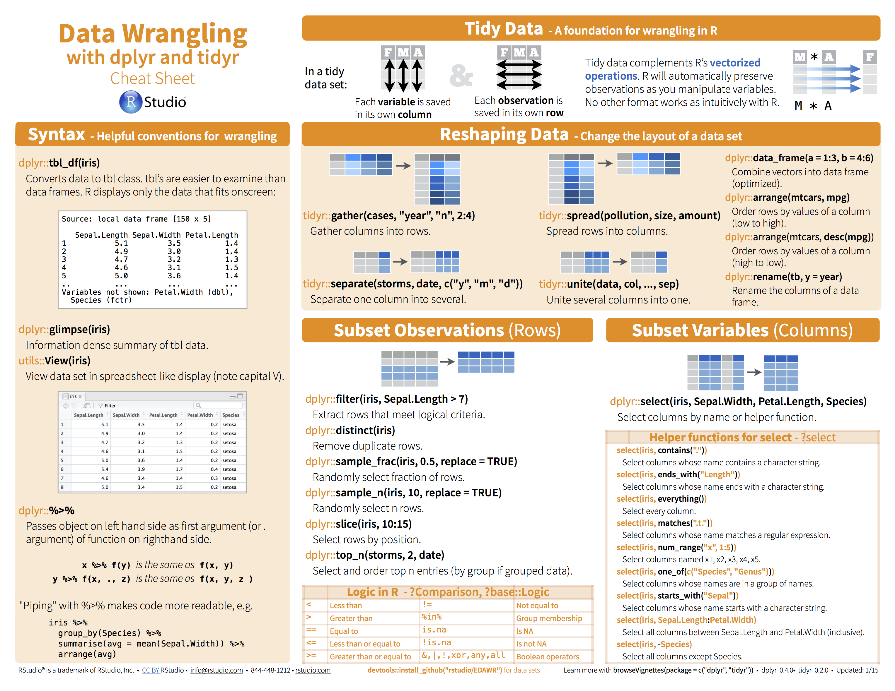
```

## Don't forget the [cheat sheet](https://www.rstudio.com/wp-content/uploads/2015/02/data-wrangling-cheatsheet.pdf)


```{r out.width = "90%", echo = FALSE}
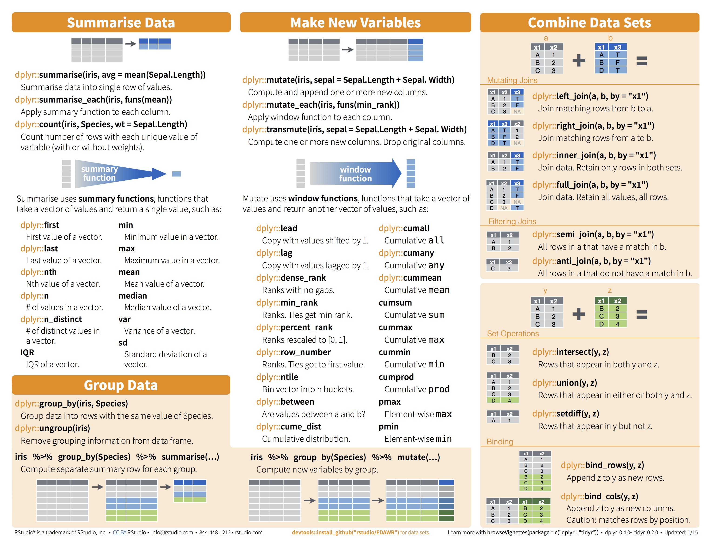
```


